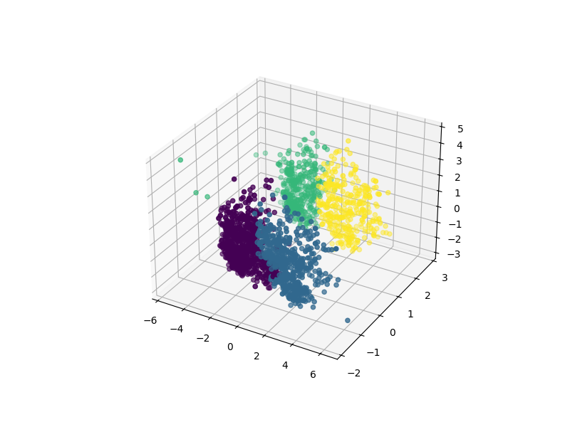

# SmartCart Customer Segmentation & Marketing Strategy

An end-to-end unsupervised machine learning project designed to segment SmartCart's customer base using **Agglomerative Hierarchical Clustering**. By profiling 2,236 active customers into 4 distinct groups, we transition from generic retail interactions to highly targeted, data-driven marketing strategies that optimize customer engagement, loyalty, and brand ROI.

---

## Project Architecture & Pipeline

The pipeline processes raw customer data through a rigorous data science workflow to extract meaningful behavioral structures:

```text
E:\SmartCart\
│
├── smartcart_customers.csv   # Raw customer dataset (2,240 initial rows)
├── segment_customers.ipynb   # Main Jupyter Notebook containing the code pipeline
└── README.md                 # Project analysis and strategic playbook

'''

## Machine Learning Workflow Summary
Data Preprocessing: Handled missing data by imputing the Income column with its median value. Filtered extreme noise and outliers by removing rows with an Age >= 90 or Income >= $600,000 (reducing the dataset from 2,240 to 2,236 rows).
Feature Engineering: Engineered core behavioral and demographic features to capture deep user profiles:
Age: Derived dynamically from the birth year.
Customer_Tenure_Days: Calculated based on the maximum signup date in Dt_Customer.
Total_spending: Consolidated spending metrics across Wines, Fruits, Meats, Fish, Sweets, and Gold.
Total_children: Aggregated from Kidhome and Teenhome.
Categorical Mapping: Grouped education levels into Undergraduate, Graduate, and Postgraduate. Simplified marital status into Partner and Single.

Dimensionality Reduction: Normalized features using StandardScaler and applied 3D Principal Component Analysis (PCA) to capture maximum variance while filtering multi-dimensional feature noise.
Model Selection: Evaluated optimal groupings using the Elbow Method (Within-Cluster Sum of Squares) and Silhouette Scores across a $K$-range of 1 to 10. Selected Agglomerative Clustering ($K=4$, Ward linkage) over standard K-Means as it provided visually denser, cleaner, and more business-interpretable cluster representations.

## Data-Driven Cluster BreakdownBased on the model's statistical summaries (cluster_summary), the 4 customer segments break down into clear demographic and behavioral archetypes:

FINANCIAL POWER (High Spend & High Income)
                                      │
          [Cluster 1]                 │               [Cluster 3]
       Affluent Partners              │            Affluent Singles
                                      │
──────────────────────────────────────┼──────────────────────────────────────
                                      │
          [Cluster 0]                 │               [Cluster 2]
     Frugal Family Partners           │             Frugal Singles
                                      │
                   BUDGET CONSCIOUS (Low Spend & Low Income)


## Cluster 0: Frugal Family Partners
Statistical Profile: Moderate Income (~$39.6k), low total spending (~$222), high number of children (average 1.24). 100% live with a partner.
Behavioral Response: Frequent deal seekers (highest deal purchases at 2.59), frequent web browsers (6.3 monthly visits), very low campaign response rate (7.6%).
Marketing Strategy:
Value Bundles: Pitch family-centric bulk promotions and "Buy One Get One" (BOGO) deals to respect their rigid budget limits.
Utility Push: Focus marketing communication on household utility and saving time. Avoid showing premium or luxury item showcases.

## Cluster 1: Affluent Partners ("The Power Couples")
Statistical Profile: Highest Income (~$72.8k), highest total spending (~$1,236), low children presence (0.51). 100% live with a partner.
Behavioral Response: Prefer high-velocity, high-value traditional shopping avenues. High catalog purchases (5.49) and store visits (8.65). Low web browsing necessity (3.5 visits).
Marketing Strategy:
Premium Cross-Selling: Direct-mail premium item catalogs tailored to dual-income dynamics (e.g., fine wine pairings or premium meat boxes).
Convenience & Subscriptions: Offer high-end automated home delivery or curated seasonal subscription plans to save them time.

## Cluster 2: Frugal Singles
Statistical Profile: Lowest Income (~$36.9k), lowest total spending (~$165), high number of children (1.27). 99.3% are single parents.Behavioral Response: Highest web browsing rate (6.6 visits/month) but lowest dollar conversion. Relies on deals (2.59). Decent response to direct marketing (14.2%).📢 Marketing Strategy:Frictionless Incentives: Target with personalized mobile flash sales or low free-shipping thresholds to ease transactional friction.Retargeting Ads: Deploy active digital ad-retargeting since they frequently browse the website but often leave items sitting in the cart.🎯 Cluster 3: Affluent Singles ("High-Value Independence")Statistical Profile: High Income (~$70.7k), massive spending (~$1,190), lowest child count (0.46). 100% are single.Behavioral Response: Highest campaign responsiveness by a massive margin (32.0%). High catalog (5.0) and web purchases (5.79). They spend heavily, independently, and react strongly to brand outreach.📢 Marketing Strategy:VIP Loyalty Programs: Target with experiential rewards, early tech-feature opt-ins, or luxury product tier upgrades.Direct Email Campaigns: Since their response rate is completely unmatched (32%), focus aggressive testing of new product lines or luxury offerings directly on this segment first.📈 Model Performance & Metrics MatrixBelow is the definitive data matrix extracted from the Agglomerative model's cluster summary:Cluster IDStructural ArchetypeAvg IncomeAvg SpendingWeb Visits/MoCampaign ResponseLiving StatusAvg Children0Frugal Family Partners$39,680$2226.37.6%100% Partner1.241Affluent Partners$72,808$1,2363.516.6%100% Partner0.512Frugal Singles$36,960$1656.614.2%99.3% Single1.273Affluent Singles$70,722$1,1903.732.0%100% Single0.46🛠️ How to Run the Clustering Pipeline1. Environment SetupMake sure you have the required analytical libraries installed in your Python environment:Bashpip install pandas matplotlib seaborn scikit-learn kneed
2. ExecutionOpen your terminal, navigate to your project home on the E: drive, and run the notebook:DOScd /d E:\SmartCart
jupyter notebook segment_customers.ipynb

***

### 💡 One Last Tip
If you saved the 3D scatter plot of your clusters as an image file (like `cluster_plot.png`), you should drop it into the README right below the **"Data-Driven Cluster Breakdown"** section using this line of code:
```markdown

